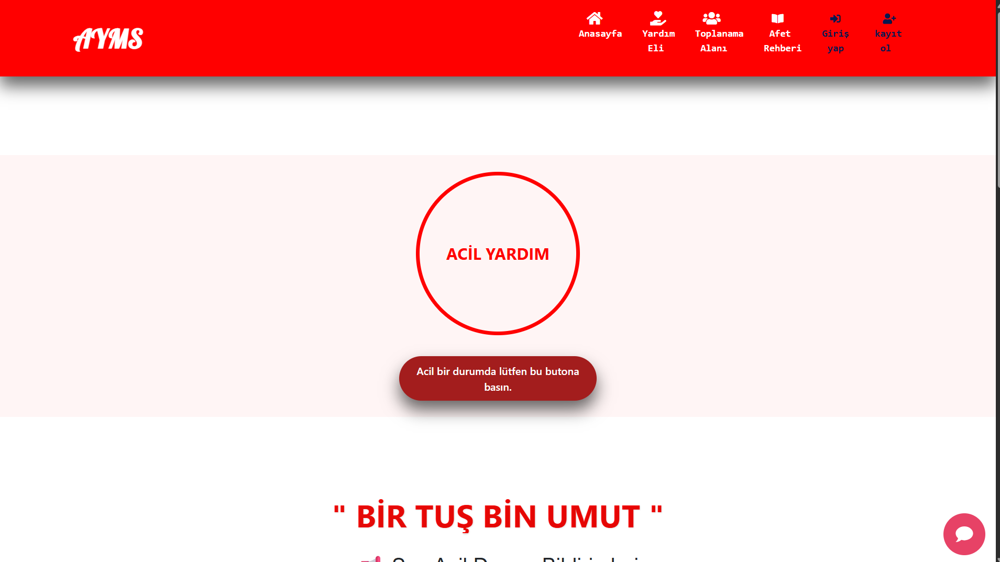

# AYMS - Acil Yardım Yönetim Sistemi

[](https://www.djangoproject.com/)
[](https://www.python.org/)

AYMS, acil durum yönetimi süreçlerini dijitalleştirmek, kullanıcıların acil durum bildirimlerini hızlıca iletmelerini sağlamak ve profil yönetimi üzerinden koordinasyonu kolaylaştırmak amacıyla geliştirilmiş bir platformdur.




## 🚀 Temel Özellikler

- **Acil Durum Bildirimleri:** Kullanıcıların acil durum sinyalleri oluşturması ve takip edilmesi.
- **Kullanıcı Profili Yönetimi:** Güvenli üyelik sistemi ve kişiselleştirilmiş kullanıcı profilleri.
- **Acil İletişim Kişileri:** Kullanıcıların acil durumlarda ulaşılabilecek yakınlarını tanımlayabilmesi.
- **Dinamik Adres Yönetimi:** Konum ve adres verilerinin sistem üzerinde tanımlanması.
- **Responsive Arayüz:** Bootstrap kullanılarak her cihazda çalışabilen modern bir tasarım.

## 🛠 Kullanılan Teknolojiler

- **Backend:** Python, Django
- **Frontend:** Bootstrap 5, JavaScript
- **Veritabanı:** SQLite (Geliştirme aşaması)
- **Versiyon Kontrolü:** Git

## 📥 Kurulum

Projeyi yerel bilgisayarınızda çalıştırmak için şu adımları izleyin:

1. **Depoyu Klonlayın:**
   ```bash
   git clone [https://github.com/kadirbiner/AYMS-Project.git](https://github.com/kadirbiner/AYMS-Project.git)
   cd AYMS-Project
